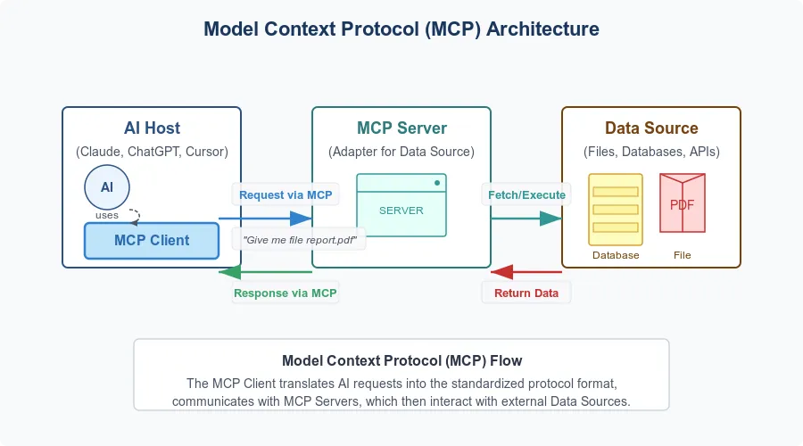

# Model Context Protocol (MCP) in AI

_Last updated: 2025-04-13_

Model Context Protocol (MCP) is an emerging concept in AI where models adapt behavior based on contextual cues — such as user role, intent, or environment. It is an open standard that defines a universal way for AI models to connect with external data sources, tools, and environments. 

MCP is especially relevant in LLMs and human-centered AI design. It is about moving from stateless Q&A to context-rich collaboration with AI.

🔗 [Model Context Protocol (MCP) Explained](https://diamantai.substack.com/p/model-context-protocol-mcp-explained)

