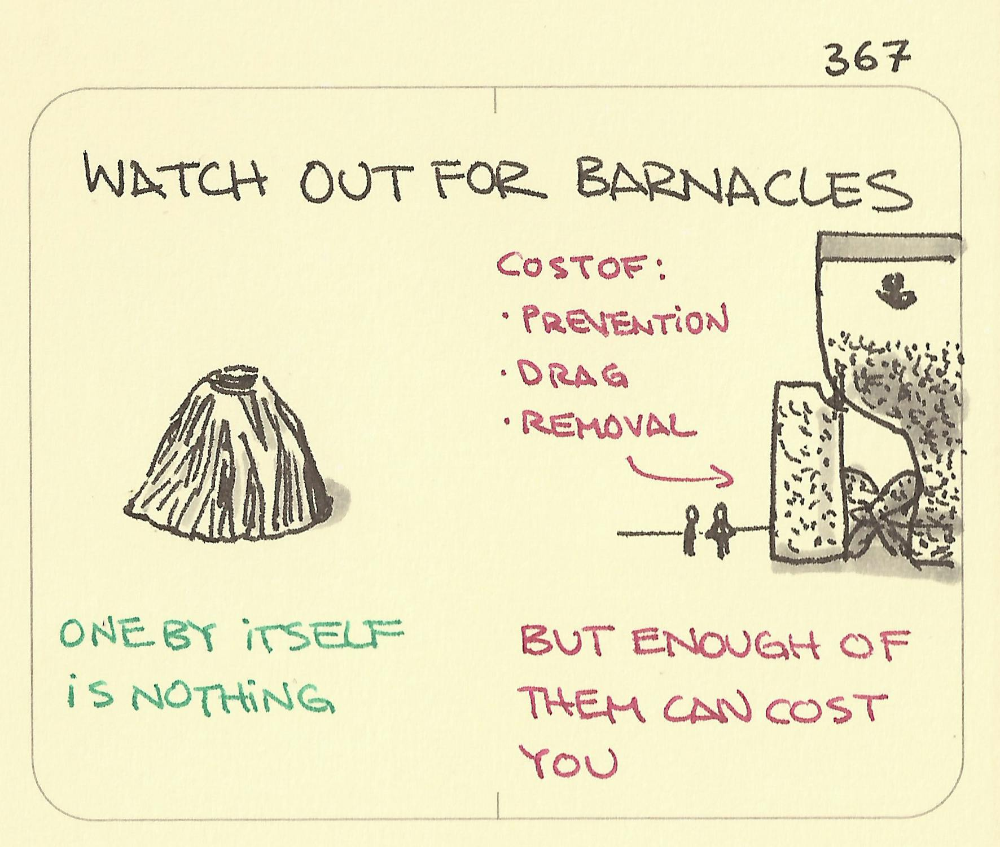

# Watch Out for Barnacles

_Last updated: 2025-12-15_

**Barnacles** is a metaphor for small issues that accumulate over time. Like barnacles on a ship's hull, one seems insignificant, but many create substantial drag and costly removal efforts. Applied to product work, it warns against letting small problems compound into major technical debt.

The key insight: individual issues appear negligible in isolation, but their cumulative effect becomes expensive and slows velocity. Prevention and early intervention cost far less than large-scale cleanup.

**Common barnacles in product work**:
- Minor bugs dismissed as "not worth fixing now"
- Small UI/UX inconsistencies across screens
- Documentation gaps and outdated specs
- Test coverage holes that grow over time
- Process workarounds that become permanent

Track small issues in a backlog and allocate 10-15% of sprint capacity to prevent accumulation. One team reduced bug fixing time by 40% after implementing monthly cleanup cycles.

🔗 [Sketchplanations - Watch Out for Barnacles](https://sketchplanations.com/watch-out-for-barnacles)  
🔗 [Managing Technical Debt - Martin Fowler](https://martinfowler.com/bliki/TechnicalDebt.html)

