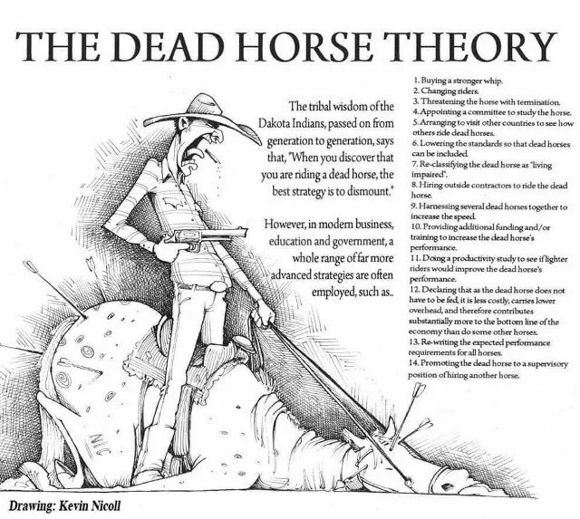

# Dead Horse Theory

_Last updated: 2025-04-13_

The Dead Horse Theory humorously highlights the futility of continuing to invest in something that's no longer working — like flogging a dead horse. It originated from a native american proverb.

> “When you discover you are riding a dead horse, the best strategy is to dismount.”

In product management, this often shows up when teams:

- Persist with failed features
- Ignore signals from the market or users
- Add more resources to "fix" fundamentally flawed ideas
- Can't let go due to sunk cost fallacy

📄 [Dead Horse Theory: How to Resurrect a Failed Project](https://themindcollection.com/dead-horse-theory/)

