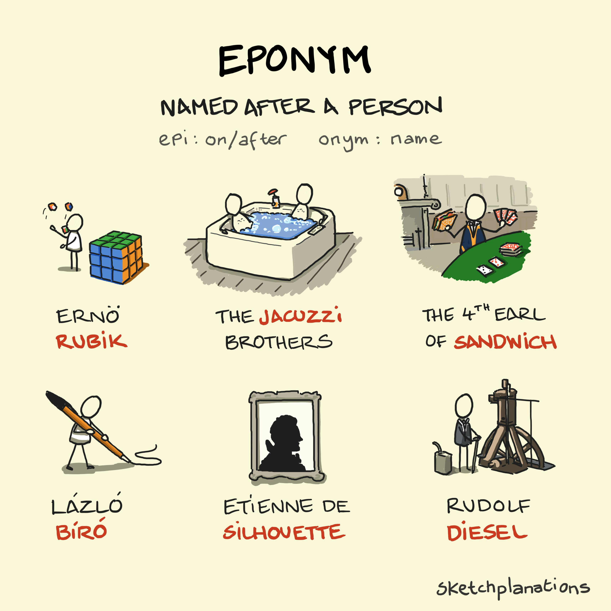

# Eponym

_Last updated: 2025-12-15_

**Eponym** is a word derived from a person or place name. Understanding eponyms helps product managers recognize innovation patterns and communicate product heritage effectively. Each eponym tells a story of problem-solving and innovation.

**Product examples**:
- **Jacuzzi** - Seven brothers engineered a therapeutic hot tub to treat a child's rheumatoid arthritis, creating a medical device that became a lifestyle brand
- **Diesel** - Rudolf Diesel invented an efficient engine solving fuel economy challenges
- **Biro** - László Bíró created the ballpoint pen after his fountain pen failed in hot weather
- **Rubik's Cube** - Professor Ernő Rubik designed a teaching tool that became one of the best-selling toys (500M+ units)

**Why it matters**:
- Eponyms demonstrate how individual innovators solved real user problems
- Product naming tied to founders creates brand authenticity and story
- Understanding origin stories reveals the "jobs to be done" that drove innovation
- Consider whether your product solves a problem worthy of becoming an eponym

🔗 [Sketchplanations - Eponym](https://sketchplanations.com/eponym)

