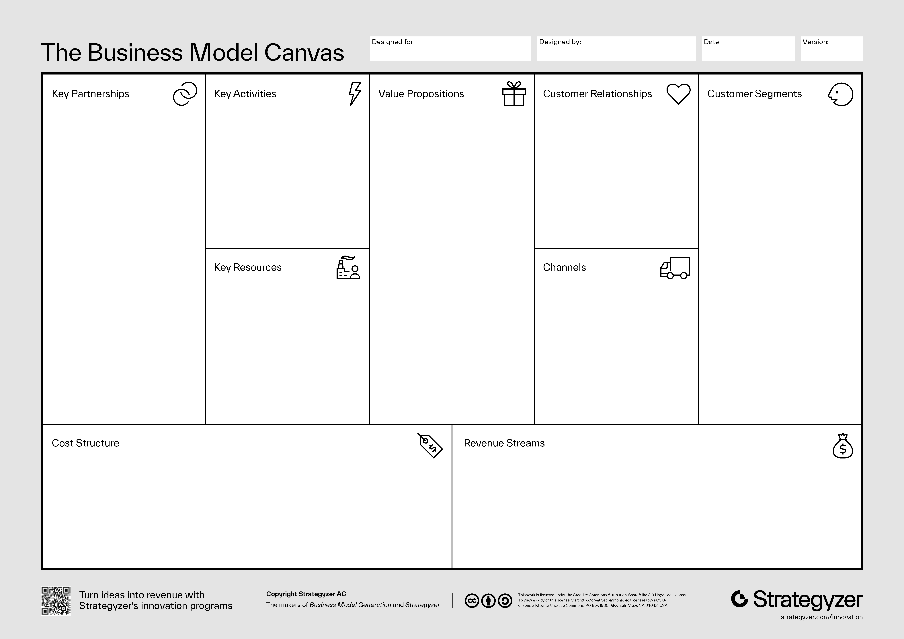

# Business Model Canvas (BMC)

_Last updated: 2025-12-14_

The **Business Model Canvas** is a one-page visual framework describing how a company creates, delivers, and captures value through nine interconnected building blocks.

**The Nine Blocks**:

1. **Customer Segments**: Who you create value for
2. **Value Propositions**: Problems solved, needs satisfied
3. **Channels**: How you reach and deliver to customers
4. **Customer Relationships**: How you acquire, retain, grow
5. **Revenue Streams**: How the business earns money
6. **Key Resources**: Strategic assets required (physical, intellectual, human, financial)
7. **Key Activities**: Critical actions to make the model work
8. **Key Partnerships**: Strategic partners and suppliers
9. **Cost Structure**: Most important costs and expenses

Use it to brainstorm new product ideas or business models, test hypotheses about customers and revenue, align cross-functional teams on strategy, communicate business logic to stakeholders and identify dependencies and risks. The canvas encourages iterative thinking and combines well with Lean Startup methodologies for rapid validation.

🔗 [Strategyzer - Business Model Canvas](https://www.strategyzer.com/canvas/business-model-canvas)  
📘 [Business Model Generation (book)](https://www.strategyzer.com/books/business-model-generation)

