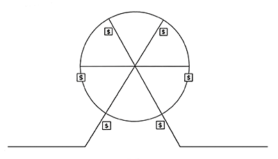

# Fractional Ownership

_Last updated: 2025-12-14_

**Fractional ownership** allows multiple parties to share ownership of an asset, dividing costs and benefits proportionally. This democratizes access to high-value assets by lowering individual investment barriers while distributing maintenance and usage rights across co-owners.

For product managers, fractional ownership unlocks markets by making premium products accessible to price-sensitive segments—especially in SaaS, digital assets, and shared economy platforms. The model reduces acquisition barriers while creating network effects and community value, turning individual products into shared resources.

Key applications:
- Shared software licenses and seat-based tools
- Co-ownership of digital assets (NFTs, tokens)
- Crowdfunding and micro-investing features
- Time-share management systems
- Peer-to-peer asset sharing platforms

🔗 [Fractional Ownership](https://learningloop.io/plays/business-model/fractional-ownership)

