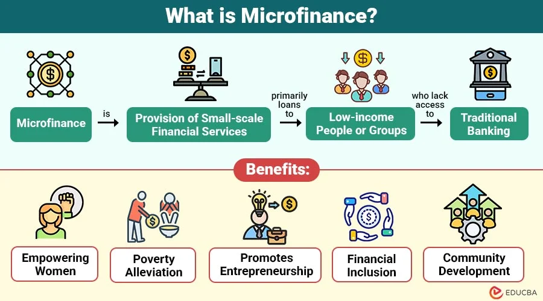

# Microfinance

_Last updated: 2025-12-14_

**Microfinance** provides small loans, savings, and financial services to low-income individuals excluded from traditional banking. Originally a poverty-reduction strategy, it enables economic participation for underserved populations. Microfinance principles inspire inclusive design for emerging markets and the "next billion users", creating sustainable business models through high-volume, low-margin transactions.

Key applications:
- Low-barrier entry points for premium features
- Micro-payment systems in digital wallets
- Tiered pricing serving diverse economic segments
- Financial inclusion features in fintech

🔗 [Understanding Microfinance: How It Benefits Low-Income Individuals](https://www.investopedia.com/terms/m/microfinance.asp)  
🔗 [Microfinance](https://learningloop.io/plays/business-model/microfinance)  

