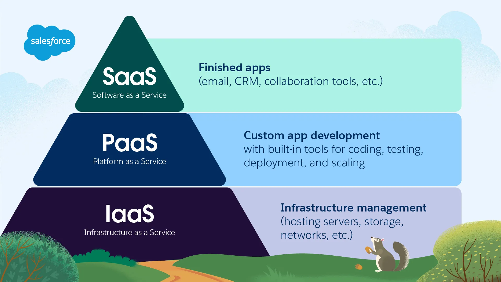

# Platform as a Service (PaaS)

_Last updated: 2025-12-14_

**PaaS** provides a complete cloud development and deployment environment, enabling developers to build, test, deploy, and manage applications without managing infrastructure.

**Cloud stack position**: IaaS (virtualized resources) → PaaS (dev tools + runtime + middleware) → SaaS (ready applications)

**What PaaS provides**: Development tools (IDEs, SDKs, testing), middleware (message queues, caching, API gateways), managed databases, runtime environments (Node.js, Python, Java), OS updates, auto-scaling compute, networking/storage (load balancers, CDNs).

**Trade-offs**: Vendor lock-in, less control, potential cost at scale, debugging complexity.

Ideal for teams wanting speed, iteration, and avoiding infrastructure complexity—especially early-stage products, MVPs, and teams without DevOps.

🔗 [PaaS: Platform as a Service Guide](hhttps://www.salesforce.com/ap/learning-centre/tech/paas/)

