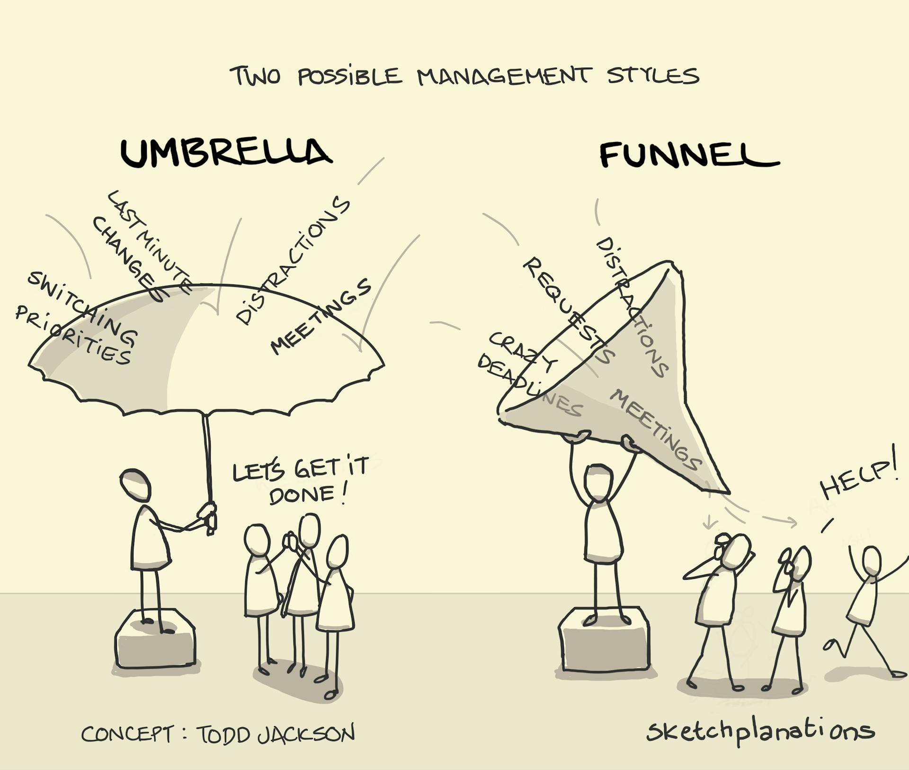

# Umbrellas and Funnels

_Last updated: 2025-12-16_

A leadership metaphor contrasting two ways product managers handle organizational pressure and stakeholder requests. You can either be an umbrella that shields your team, or a funnel that pours every distraction straight through.

**The Umbrella (Best Practice)**: Acts as a protective filter, blocking distractions, conflicting priorities, and last-minute changes so the team can focus on strategic work. The PM absorbs organizational chaos and translates it into clear, prioritized direction.

**The Funnel (Anti-pattern)**: Passes through every request, deadline, and stakeholder whim directly to the team, creating constant context-switching and preventing meaningful progress. The team gets the full force of organizational dysfunction.

**Key principles:**
- Protect your team's focus by saying "no" strategically and often
- Filter requests through your product strategy before escalating to the team
- Convert vague stakeholder demands into concrete, well-scoped problems
- Shield the team from politics while keeping them informed of relevant context

**Example**: When three executives request urgent features mid-sprint, the umbrella PM evaluates them against roadmap goals, negotiates timelines, and brings only the validated, scoped work to the team. The funnel PM immediately interrupts the team with all three requests, creating chaos.

🔗 [Funnels vs. Umbrellas](https://www.svpg.com/funnels-vs-umbrellas/)  
🔗 [Sketchplanations](https://sketchplanations.com/umbrella-funnel)

