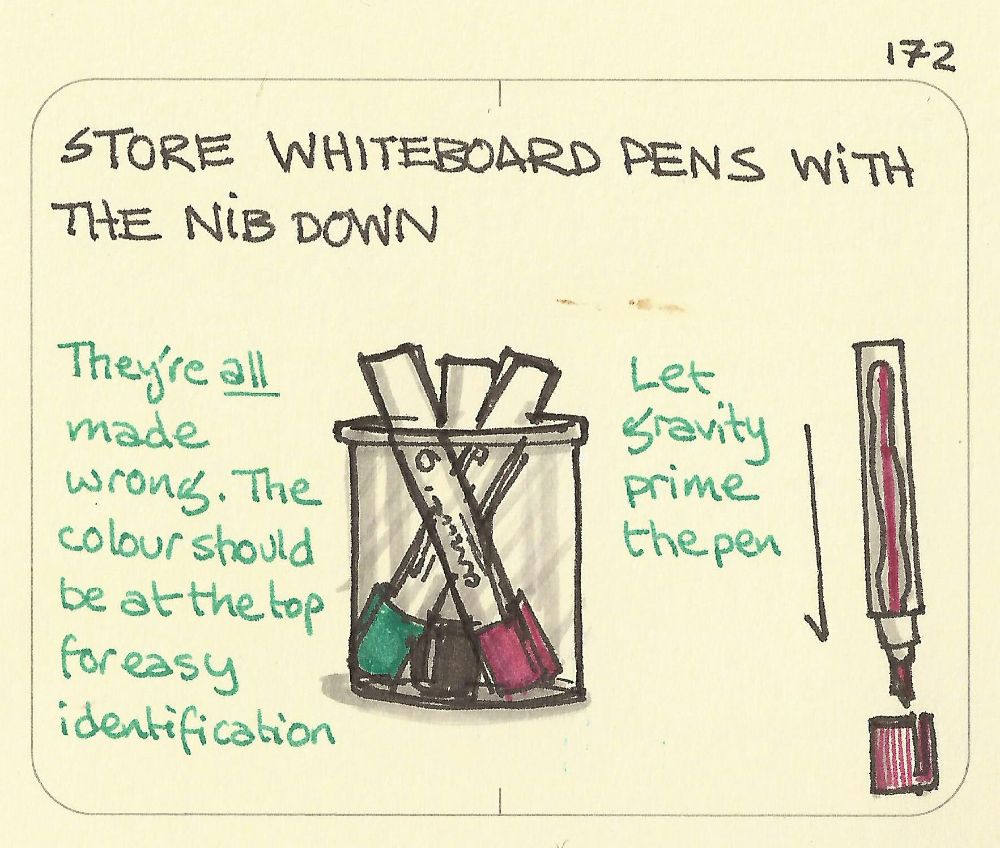

# Store Whiteboard Pens Nib Down

_Last updated: 2025-12-15_

**Store whiteboard pens with the nib down** to keep them working reliably. When markers sit tip-up, ink separates from the nib, making them appear dead when they just need "recharging." Storing them vertically with the writing end down keeps ink in contact with the nib. This simple habit eliminates the common frustration of grabbing non-functional markers during workshops, standups, and design sessions. It extends marker life and ensures your brainstorming sessions don't stall. Nothing derails a design sprint faster than hunting for working markers. Teams report 50%+ reduction in dead markers after switching to nib-down storage.

🔗 [Sketchplanations - Store Whiteboard Pens with the Nib Down](https://sketchplanations.com/store-whiteboard-pens-with-the-nib-down)

