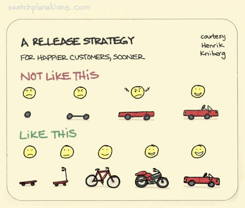

# A Release Strategy for Happier Customers, Sooner

_Last updated: 2025-12-16_

Focus on delivering incremental value that helps customers accomplish their goals progressively rather than waiting for a complete solution. This approach prioritizes learning and customer feedback early in the development cycle.

The key insight is to provide the next piece of functionality that makes customers' lives a little better than before. Like building a skateboard before a car, each iteration should be usable and valuable on its own, even if it's not the final vision.

This strategy enables teams to start learning immediately, gather real usage data, and adjust direction based on customer feedback rather than assumptions.

**Key principles:**

- Deliver working functionality at every incremental step
- Each release should provide tangible value to users
- Start learning from customer feedback as soon as possible
- Accept that rework is worthwhile for earlier validation
- Prioritize outcome over complete feature sets

🔗 [A release strategy for happier customers, sooner](https://sketchplanations.com/release-strategy)

