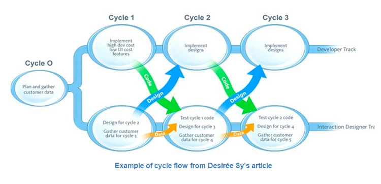

# Dual Track Agile

_Last updated: 2025-12-14_

**Dual Track Agile** runs two parallel, continuous tracks: Discovery (figuring out what to build) and Delivery (building it). This ensures teams validate ideas before committing development resources, reducing waste and increasing the likelihood of building the right thing. 

1. **Discovery**: Continuous research and experimentation to identify problems worth solving. Through user interviews, usability testing, prototype validation, exploring multiple solutions in parallel, testing hypotheses with low-fidelity prototypes. Outcome: Validated, de-risked opportunities ready for development

2. **Delivery**: Building, testing, and shipping validated features. Through agile practices, incremental delivery with quality engineering. Outcome: High-quality features delivered to users

**How tracks interact**: Discovery feeds Delivery with validated opportunities; Discovery runs 1-2 sprints ahead; insights from shipped features inform new discovery; both run simultaneously with regular handoffs.

**Why it matters**: Reduces building wrong things, enables evidence-based decisions, continuous learning, faster feedback loops (test with prototypes before code), better collaboration.

**Avoid**: Treating discovery as gate vs. continuous activity, running discovery without engineering input, skipping discovery under time pressure, over-researching, not sharing insights broadly, separating into different teams.

🔗 [Dual Track Development is not Duel Track](https://jpattonassociates.com/dual-track-development/)  
🔗 [Dual Track Agile](https://www.svpg.com/dual-track-agile/)

