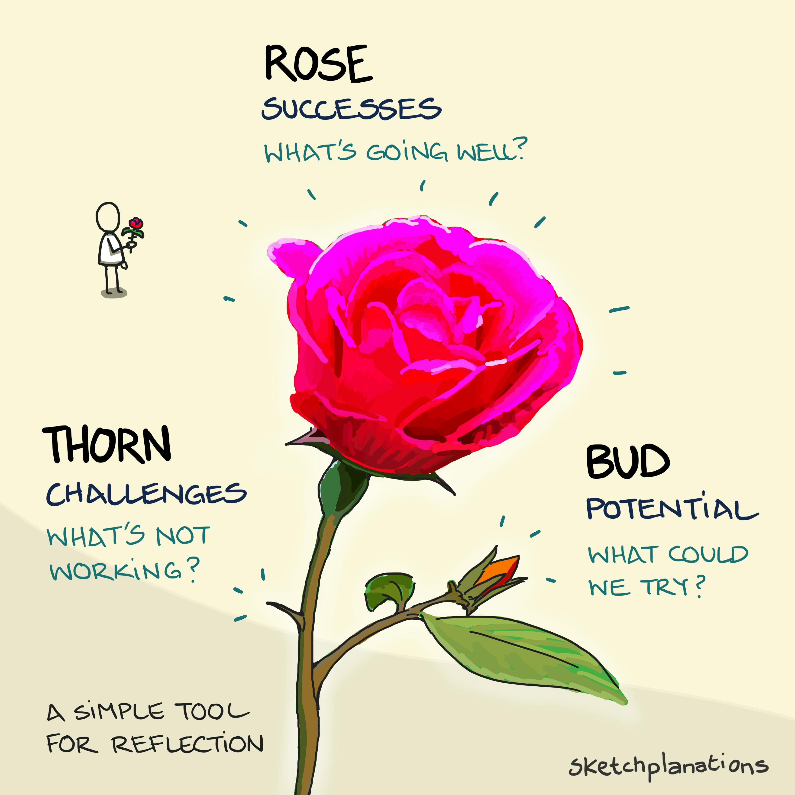

# Rose, Thorn, Bud

_Last updated: 2025-12-15_

**Rose, Thorn, Bud** is a simple retrospective framework using a rose metaphor to balance reflection on successes, challenges, and opportunities. It's ideal for sprint retrospectives, feature post-mortems, or quarterly reviews. Use after product launches to capture what resonated with users (roses), what friction emerged (thorns), and what new opportunities surfaced (buds). The framework keeps retrospectives balanced and forward-looking.

**The three elements**:
- **Rose** - What went well? Wins, successes, highlights worth celebrating
- **Thorn** - What were the challenges? Pain points, blockers, areas for improvement
- **Bud** - What are emerging opportunities? Ideas to explore, potential to unlock

🔗 [Sketchplanations - Rose, Thorn, Bud](https://sketchplanations.com/rose-thorn-bud)

