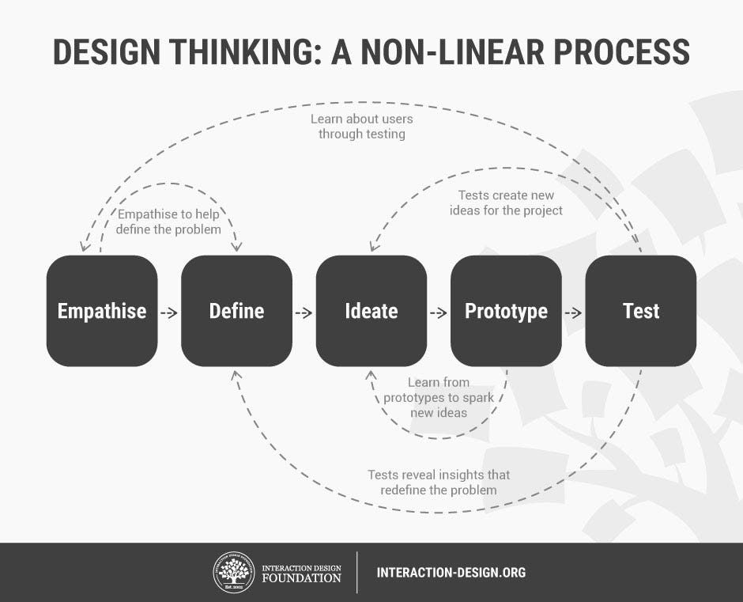

# Design Thinking

_Last updated: 2025-07-19_

> Design thinking is a human-centered approach to innovation that draws from the designer's toolkit to integrate the needs of people, the possibilities of technology, and the requirements for business success. – Tim Brown, CEO of IDEO

It encourages divergent thinking and experimentation to create solutions that are both desirable, feasible and viable. The 5 phases:
Empathize, Define, Ideate, Prototype, Test.

🔗 [Design Thinking (DT)](https://www.interaction-design.org/literature/topics/design-thinking)  
🔗 [The home of design thinking](https://designthinking.ideo.com/)
