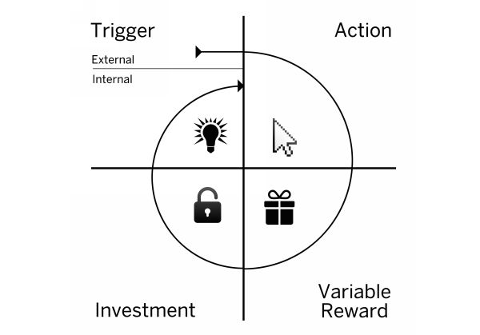

# The Hooked Model

_Last updated: 2025-07-19_

Coined by Nir Eyal, the Hooked Model explains how habit-forming products keep users coming back by triggering behavior loops. Used by products like Instagram, Twitter, and TikTok to create user habits.

The 4-Step Loop:
1. **Trigger** – Cue that prompts behavior (external or internal)
2. **Action** – Simple behavior in anticipation of reward
3. **Variable Reward** – Unpredictable feedback that builds engagement
4. **Investment** – Effort that increases likelihood of returning

🔗 [The Hooked Model: How to Manufacture Desire in 4 Steps](https://www.nirandfar.com/how-to-manufacture-desire/)  
📘 [Hooked: How to Build Habit-Forming Products](https://www.nirandfar.com/hooked/)  
