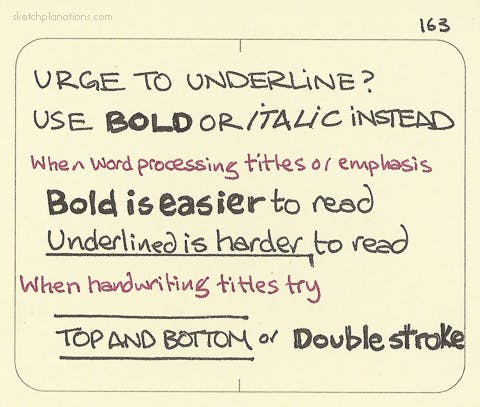

# Underline vs Bold vs Italic

_Last updated: 2025-12-15_

Underlining is a typewriter relic, not good design. Use bold or italic instead for text emphasis in digital products. Underlining reduces readability by cutting through descenders (g, j, p, q, y) and creates confusion in digital contexts where underlines signal hyperlinks. Professional typography uses font weight and style variations instead.

**Best practices for product work**:
- Bold for strong emphasis, headings, and key actions
- Italic for moderate emphasis, technical terms, or quotations
- Reserve underlines exclusively for interactive links

🔗 [Sketchplanations - Urge to Underline](https://sketchplanations.com/urge-to-underline-use-bold-or-italic-instead)

