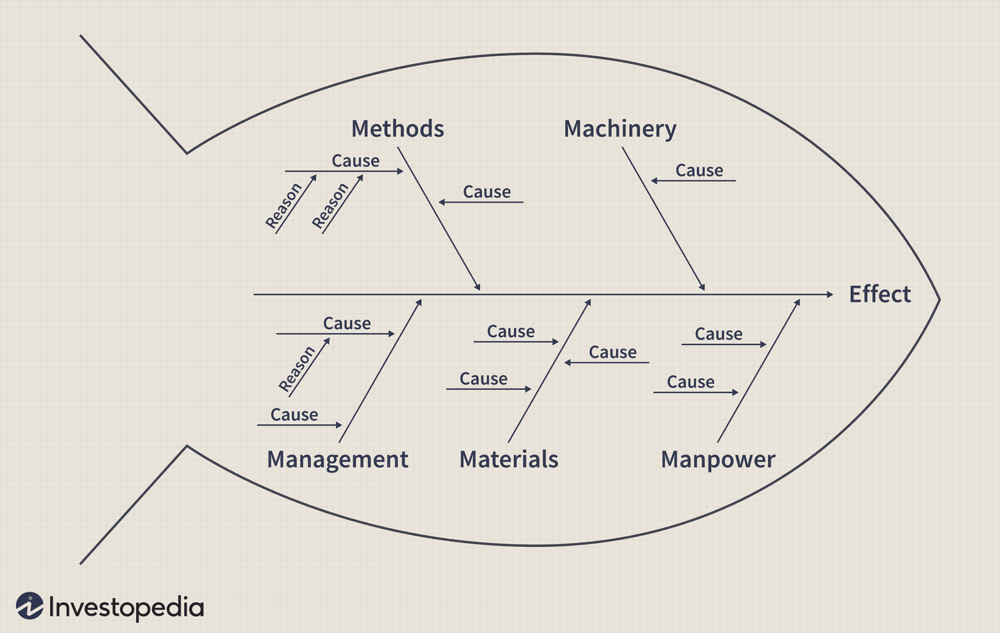

# Ishikawa (Fishbone) Diagram

_Last updated: 2025-04-13_

Ishikawa diagrams (also called fishbone diagrams, herringbone diagrams, cause-and-effect diagrams) are causal diagrams created by Kaoru Ishikawa that show the potential causes of a specific event.

It can be used to systemically explore and categorise the various factors that might contribute to a problem or desired outcome. It help in understanding and organising ideas to facilitates better communication.

Examples include the 5 Ms (used in manufacturing), the 8 Ps (used in product marketing), the 4 Ss (used in service industries).

📄 [Ishikawa Diagram](https://www.investopedia.com/terms/i/ishikawa-diagram.asp)  

