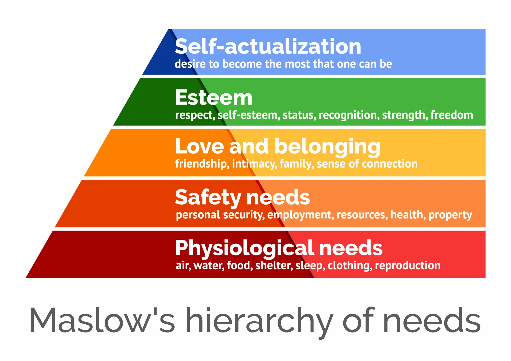

# Maslow's Hierarchy of Needs

_Last updated: 2025-04-13_

Maslow's Hierarchy of Needs is a psychological theory proposed by Abraham Maslow that organises human motivations into five ascending levels, often illustrated as a pyramid. Each level represents a category of needs, and higher levels become relevant only after lower-level needs are sufficiently met.

The 5 Levels of the Pyramid:
1. Physiological Needs – Food, water, shelter, rest
2. Safety Needs – Personal and financial security, health, stability
3. Love & Belonging – Relationships, friendships, community
4. Esteem Needs – Self-respect, recognition, achievement
5. Self-Actualization – Fulfilling personal potential, creativity, purpose

🔗 [A Theory of Human Motivation](https://psychclassics.yorku.ca/Maslow/motivation.htm#r13)

