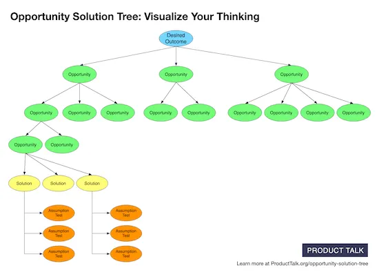

# Opportunity Solution Tree

_Last updated: 2025-04-13_

The Opportunity Solution Tree (OST), created by product discovery expert Teresa Torres, is a visual framework that helps product teams connect their desired outcomes with opportunities, solutions, and experiments.

### Structure of the Tree:
- Outcome (Root): The measurable result you're trying to achieve
- Opportunities (Branches): Customer needs, pain points, or desires
- Solutions (Leaves): Ideas or features that could address those opportunities
- Experiments (Twigs): Tests to validate or invalidate your proposed solutions

Use OSTs in discovery workshops, roadmap planning, or as a continuous learning tool.

🔗 [Opportunity Solution Trees: Visualize Your Discovery to Stay Aligned and Drive Outcomes](https://www.producttalk.org/2020/05/the-opportunity-solution-tree/)

