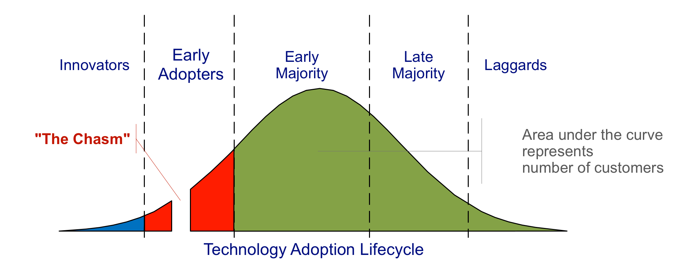

# Crossing the Chasm

_Last updated: 2025-04-13_

Crossing the Chasm originated from Geoffrey Moore's 1991 book of the same name, which popularised the idea of a significant gap in market adoption between early adopters and the early majority in the technology adoption lifecycle. This gap, the "chasm," is a key challenge for startups and innovative products striving to gain widespread market acceptance. The theory builds on Everett Rogers's 1962 "Diffusion of Innovations" model, which describes different segments of the market with varying attitudes towards adopting new products. 

The “chasm” is the gap between visionaries (early adopters) and pragmatists (early majority). Many startups fail here because they try to scale before they’ve adapted their strategy for the mainstream market.

How to Cross the Chasm:
- Focus on a niche beachhead segment where you can dominate
- Deliver a complete, compelling solution that solves a real problem
- Use proof points, references, and targeted messaging to build credibility
- Delay broader expansion until you’ve won the niche

📘 [Crossing the Chasm, 3rd Edition](https://amzn.asia/d/9N1UH5M)  
🔗 [‘Crossing the Chasm’, in Practice](https://a16z.com/crossing-the-chasm-in-practice/)

