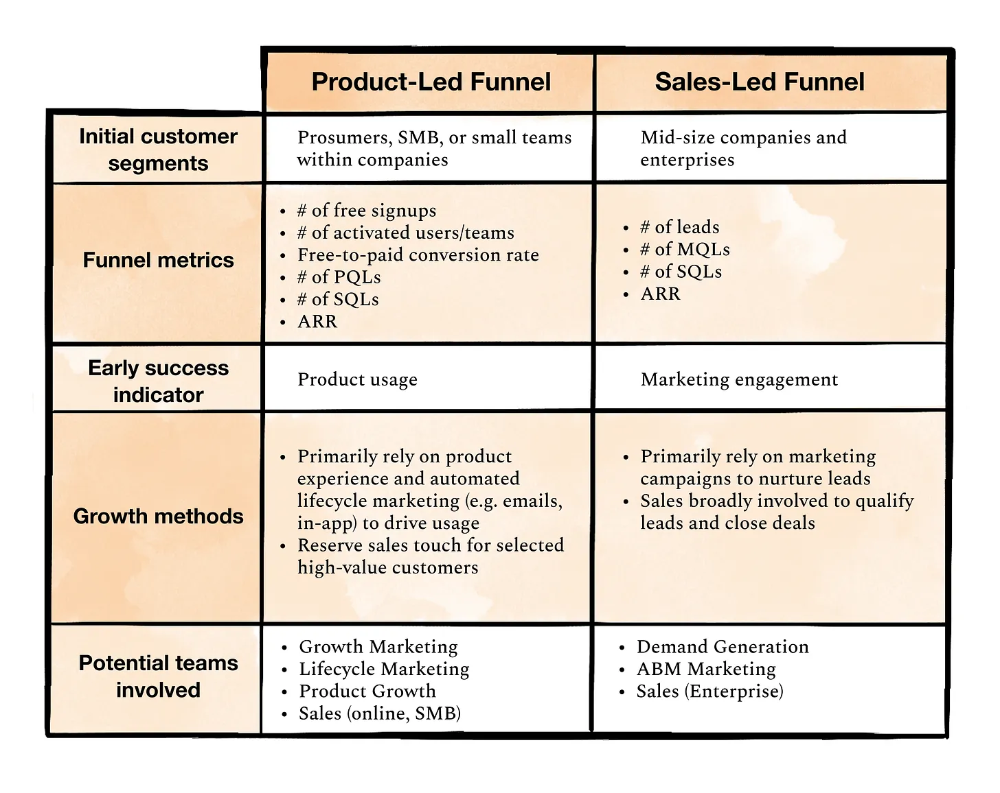

# Product-Led Growth (PLG)

_Last updated: 2025-04-13_

PLG is a go-to-market strategy where the product itself drives acquisition, expansion, conversion and retention. The term was officially coined in 2016 by Blake Bartlett of OpenView. It is used by companies like Slack, Notion, and Figma to scale without heavy sales.

Core principles:
1. The Product Is the Funnel: Users try → get value → upgrade — all within the product
2. Try Before You Buy: Freemium, free trials, and sandbox modes lower the barrier to entry
3. User Onboarding Is Critical: Success is measured by how quickly users reach their “aha moment”
4. Self-Serve and Scalable: Users can explore, evaluate, and expand usage without salespeople with built-in upgrade paths, pricing pages, and support tools enable growth without human touch.
5. Virality and Advocacy Are Embedded: Sharing, collaboration, and network effects are built into the product. It grows through word of mouth and organic distribution.
6. Product-Qualified Leads (PQLs): Leads are qualified based on product behavior, not marketing fit or sales interaction.

📄 [Inventing Product-Led Growth: How PLG Went From An Idea to the Biggest Trend In Software](https://openviewpartners.com/blog/inventing-product-led-growth/)  
📄 [What is product-led growth?](https://www.productled.org/foundations/what-is-product-led-growth)  
📄 [Five steps to starting your product-led growth motion](https://www.lennysnewsletter.com/p/five-steps-to-starting-your-plg-motion)

