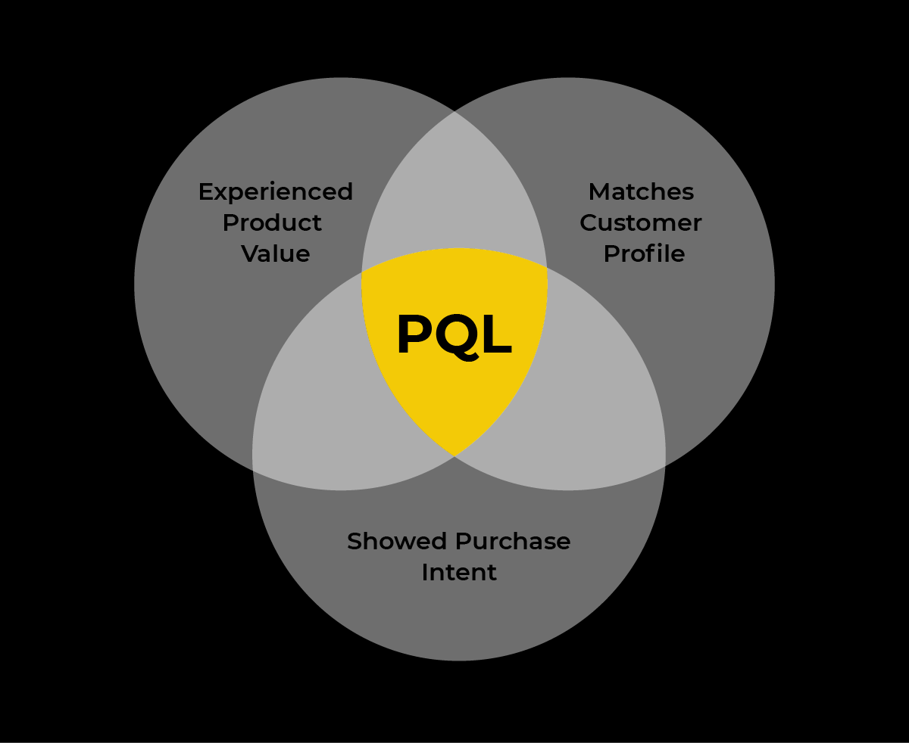

# Product-Qualified Leads (PQLs)

_Last updated: 2025-12-14_

**PQL** is a user who experienced meaningful product value and demonstrated behavioral signals indicating high conversion likelihood. Unlike MQLs (marketing engagement) or SQLs (sales conversations), PQLs are based on actual product usage and value realization, a cornerstone of Product-Led Growth. PQLs convert 20-40% better than MQLs (experienced value), shorter sales cycles, product-led efficiency, better resource allocation, product insights, team alignment.

**Key characteristics**: Value-based (reached "aha moment"), behavioral signals (actions in product), self-directed (qualify through own usage), context-specific (varies by product).

**Common PQL signals**:
- **Activation**: Completed onboarding, invited team, integrated tools, created first project
- **Usage depth**: Used core feature X times in Y days, engaged with premium features, returned multiple days
- **Expansion**: Hit limits (storage, seats, API calls), requested paid features, attempted gated functionality
- **Engagement**: Significant time in product, explored multiple features, uploaded data, configured for long-term use

🔗 [Product is the Future of Growth - Here's Why](https://www.reforge.com/blog/freemium-product-future-of-growth)
🔗 [Beginner's guide to Product Qualified Leads (PQL)](https://productled.com/blog/product-qualified-leads)

