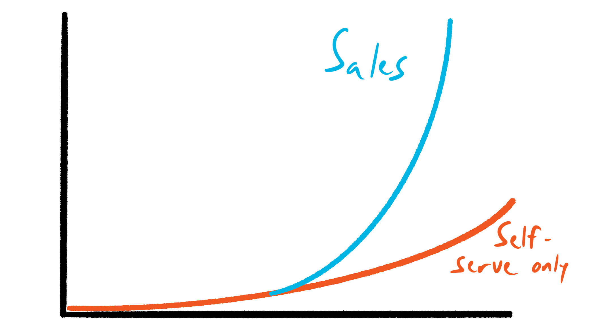

# Product Self-Service

_Last updated: 2025-12-14_

**Product self-service** empowers users to onboard, learn, troubleshoot, and extract value independently—without sales teams, support, or implementation specialists. It's foundational to Product-Led Growth (PLG) and scales user acquisition without scaling headcount. Design for marginal user (zero context), show don't tell (interactive vs. docs), anticipate friction, make help discoverable, measure and iterate, balance automation with human escalation, localize and personalize.

**Core components**:
- **Onboarding**: Interactive tours, tooltips, empty states, progressive disclosure, checklists
- **In-app guidance**: Embedded help, searchable knowledge bases, videos, contextual links, smart defaults
- **Support channels**: Help centers, FAQs, community forums, chatbots, in-app messaging, status pages
- **Account management**: Self-service billing, upgrades/downgrades, usage dashboards, team management, settings
- **Trial/freemium**: No-friction signup, immediate value access, clear free-to-paid paths, self-checkout

**Why it matters**:
- Scalability without proportional headcount growth
- Lower CAC (product sells itself)
- Faster time-to-value (immediate access)
- Better UX (solve problems on own timeline)
- Data-driven insights (track friction points)
- Global reach (24/7 across languages)
- Reduced churn (self-learners more engaged)

**Metrics**: Onboarding completion, time-to-first-value, self-service resolution rate, support deflection, feature adoption, free-to-paid conversion, support cost per user.

🔗 [Pros and Cons of Self-Serve, Sales-Driven, and the Hybrid Sales Model](https://productled.com/blog/pros-and-cons-of-self-serve-sales-driven-hybrid-model)  
🔗 [Product Self-Service - Let your product automate its own operation and maintenance](https://learningloop.io/plays/business-model/product-self-service)  
🔗 [Lessons from going freemium: a decision that broke our business](https://www.lennysnewsletter.com/p/lessons-from-going-freemium-a-decision)  
🔗 [The Transition: Layering sales onto a bottom-up self-serve product](https://www.lennysnewsletter.com/p/sales-bottom-up)  

