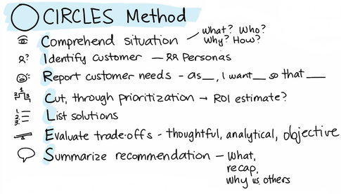

# CIRCLES Method

_Last updated: 2025-04-13_

Lewis Lin’s CIRCLES Method is a helpful framework to build much of your approach to answering product management interview questions.

His thoughts on user stories are also incredibly helpful and the graphics throughout the book paint a more tangible picture for how you may want to approach different interview questions.

📘 [Decode and Conquer](https://a.co/d/c5p7QaU)

