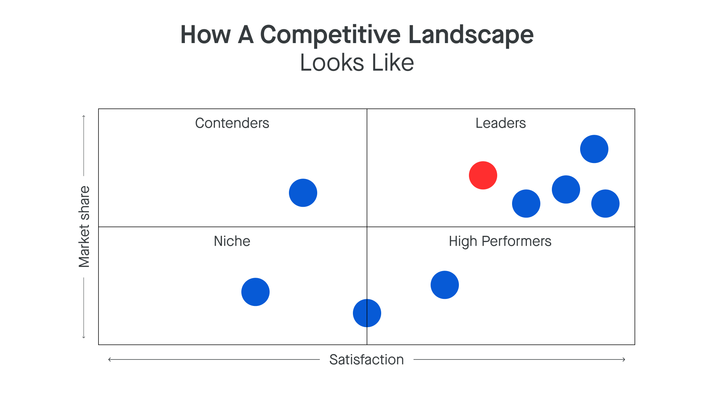

# Competitive Landscape

_Last updated: 2025-12-14_

The **competitive landscape** is a strategic analysis and visual representation of key players, market dynamics, and competitive forces. It shows how companies position themselves, compete for customers, and differentiate.

**Core components**:
1. **Direct competitors**: Similar products, same segments
2. **Indirect competitors**: Alternative solutions, different approaches
3. **Potential entrants**: Companies that could enter
4. **Substitute products**: Different solutions, same problem
5. **Market trends**: Emerging tech, regulatory shifts, customer preferences

**Why it matters**:
- Identify market gaps and unmet needs
- Inform strategy: differentiate vs. match table stakes
- Guide positioning and messaging
- Anticipate threats and disruption
- Set pricing strategy
- Prioritize features for competitive advantage

**Visualization methods**: Perceptual maps, feature matrices, quadrant diagrams, market share charts, value curves.

**Best practices**: Update regularly, look beyond obvious competitors, focus on customer perception, understand business models, monitor hiring/funding/partnerships.

🔗 [Competitive Landscape Analysis in 2025. Your Essential Guide](https://www.papermark.com/blog/competitive-landscape-analysis)  
🔗 [Competitive Landscape](https://www.productplan.com/glossary/competitive-landscape/)

