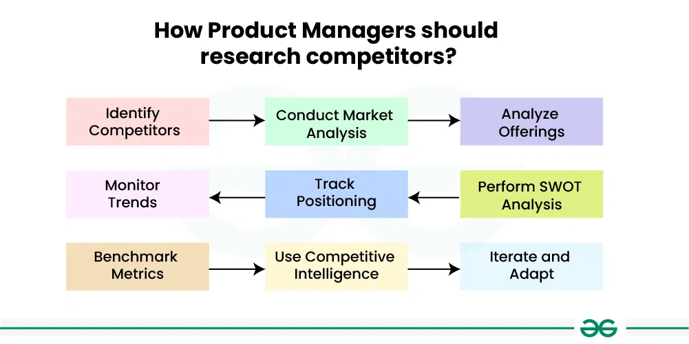

# Competitor Analysis

_Last updated: 2025-12-14_

**Competitor analysis** systematically evaluates competitors' products, strategies, strengths, and weaknesses to inform product strategy, positioning, and differentiation. Effective analysis goes beyond features to examine business models, go-to-market, and customer segments. The goal isn't copying, it's understanding the landscape to make strategic choices about where to compete and how to win.

**Key components**:
- **Product capabilities**: Features, UX, performance, integrations
- **Business model**: Pricing, customer segments, distribution, acquisition
- **Positioning**: Messaging, value prop, target personas, reviews
- **Strengths & weaknesses**: What they excel at, vulnerabilities, gaps

**Common frameworks**:
- **SWOT**: Strengths, Weaknesses, Opportunities, Threats
- **Porter's Five Forces**: Industry dynamics and competitive pressures
- **Feature matrix**: Side-by-side comparisons for differentiation

**Using insights**:
- Build unique capabilities competitors can't replicate
- Balance table-stakes with differentiation
- Position pricing against value perception
- Target underserved segments
- Enable sales with competitive talking points

🔗 [How product managers should research competitors](https://www.aha.io/roadmapping/guide/product-strategy/how-should-product-managers-research-competitors)

