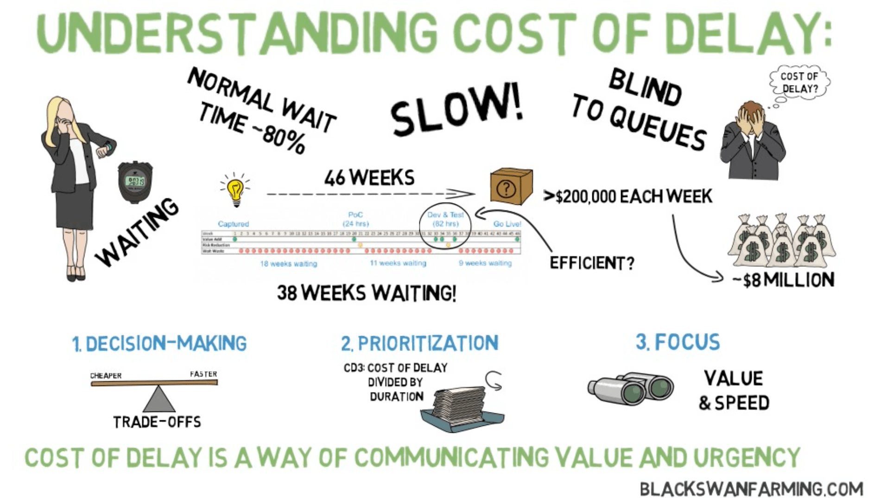

# Cost of Delay

_Last updated: 2025-12-14_

**Cost of Delay (CoD)** quantifies the financial impact of delaying work, making opportunity cost explicit and measurable. It answers: "How much value do we lose each week/month by not having this capability?"

**Why it matters**: Shifts focus from "what's valuable" to "what's valuable now," balancing impact with time-sensitivity.

**CoD Profiles**:
- **Standard**: Value accrues steadily (feature improvements)
- **Fixed date**: Sharp value drop after deadline (compliance, events)
- **Expedite**: Extremely high urgency (critical bugs, security)
- **Intangible**: Hard to quantify but strategic (tech debt, research)

**Using CoD**:
- **WSJF**: CoD ÷ Job Size—prioritizes high delay cost, low effort
- **Sequencing**: Compare CoD across initiatives
- **Resource allocation**: Justify expedited delivery

**Calculation**: Estimate value → Determine duration → Calculate cost per period → Adjust for urgency

Example: $120K annual feature delayed 3 months = $30K lost ($10K/month CoD)

Powerful for portfolio management and balancing competing priorities with economic reasoning.

🔗[Black Swan Farming: What is Cost of Delay?](https://blackswanfarming.com/cost-of-delay/)

