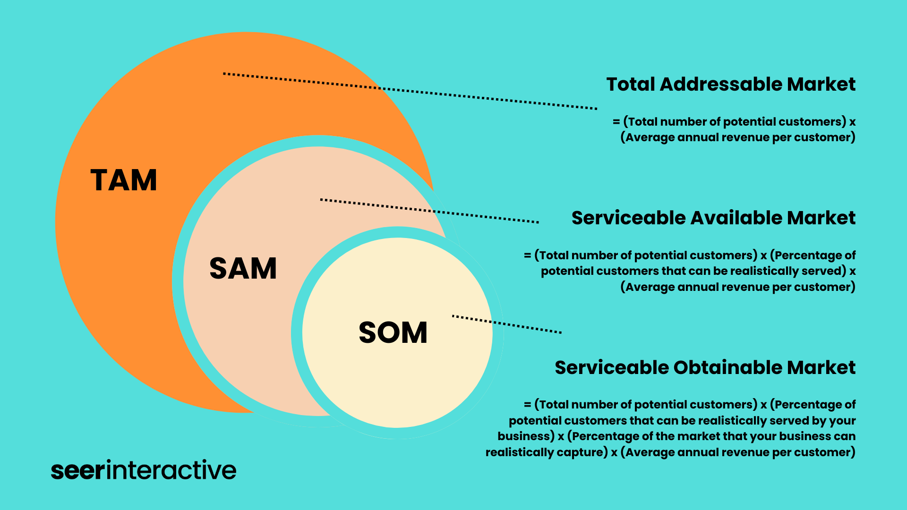

# Total Addressable Market (TAM)

_Last updated: 2025-12-14_

**Total Addressable Market (TAM)** represents the total revenue opportunity if a product achieved 100% market share. It quantifies the full scope of demand for a solution, helping PMs and founders assess whether a market justifies investment.

TAM is analyzed alongside:
- **SAM (Serviceable Available Market)**: Portion you can realistically serve based on geography, capabilities, or business model
- **SOM (Serviceable Obtainable Market)**: Market share you can actually capture near-term

Common calculation methods:
- **Top-down**: Industry reports and market research
- **Bottom-up**: Pricing times potential customer count
- **Value theory**: Value delivered to customers

Understanding TAM helps prioritize segments, set pricing, and communicate vision to stakeholders and investors.

🔗 [Sizing Your Market Opportunity](https://www.linkedin.com/pulse/sizing-your-market-opportunity-bill-reichert-1c/)  
🔗 [TAM, SAM & SOM: How To Calculate The Size Of Your Market](https://www.antler.co/blog/tam-sam-som)

