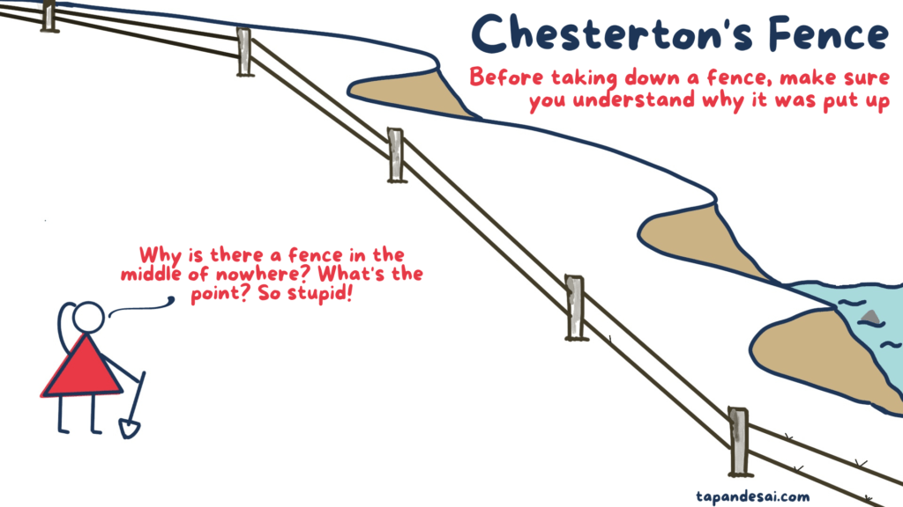

# Chesterton's Fence

_Last updated: 2025-07-19_

Chesterton’s Fence is a mental model that warns against removing or changing a system without understanding why it exists in the first place.

> “Do not remove a fence until you know why it was put up in the first place.”

Why it matters in Product Management:
- Avoid breaking useful legacy processes or features
- Encourages asking: “What problem was this solving?”
- Supports thoughtful iteration and refactoring

Use it in product audits, deprecation decisions, and redesigns.

🔗 [Chesterton’s Fence: A Lesson in Thinking](https://fs.blog/chestertons-fence/)

