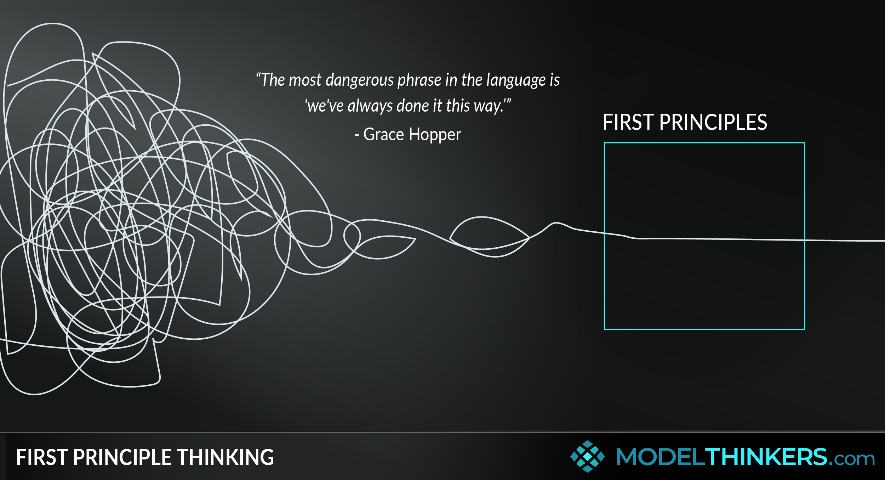

# First Principles Thinking

_Last updated: 2025-07-19_

First Principles Thinking is a mental model that involves breaking down complex problems into their most basic, foundational elements—and then reasoning up from there. Instead of relying on analogy or convention, you ask: “What do we know for sure to be true?” and build solutions from the ground up.

In product management, this approach encourages challenging assumptions, uncovering root causes, and generating innovative solutions.

> "Reasoning by first principles is one of the best ways to develop mental models and uncover opportunities others miss." — Elon Musk

When evaluating a feature request, try ask:  
- What problem are we really solving?  
- What assumptions are we making?  
- What are the fundamental constraints?

🔗 [What is First Principles Thinking?](https://fs.blog/first-principles)

