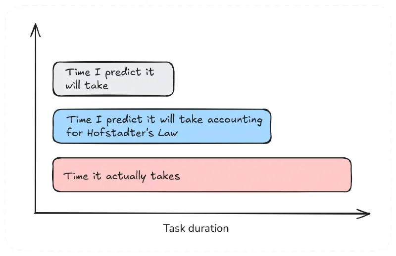

# Hofstadter's Law

_Last updated: 2025-12-16_

Hofstadter's Law states: "It always takes longer than you expect, even when you take into account Hofstadter's Law." This recursive, self-referential observation captures the persistent human tendency to underestimate task complexity and duration.

Introduced in Douglas Hofstadter's Pulitzer Prize-winning book "Gödel, Escher, Bach," the law explains why software projects, product launches, and feature development consistently overrun estimates. Even when product managers account for potential delays, unforeseen complications arise.

The law's recursive nature - referencing itself in its own definition - mirrors the compounding effects of optimism bias, hidden dependencies, and emergent complexity in product development.

**Product management implications:**

- Build buffer time into roadmaps and release plans
- Use historical data (like Yesterday's Weather) for estimates
- Communicate realistic timelines to stakeholders
- Account for dependencies, integration work, and edge cases
- Expect the unexpected, even when you plan for it

📘 [Gödel, Escher, Bach: An Eternal Golden Braid by Douglas Hofstadter](https://www.amazon.com/G%C3%B6del-Escher-Bach-Eternal-Golden/dp/0465026567)  
🔗 [Hofstadter's Law](https://lawsofsoftwareengineering.com/laws/hofstadters-law/)

