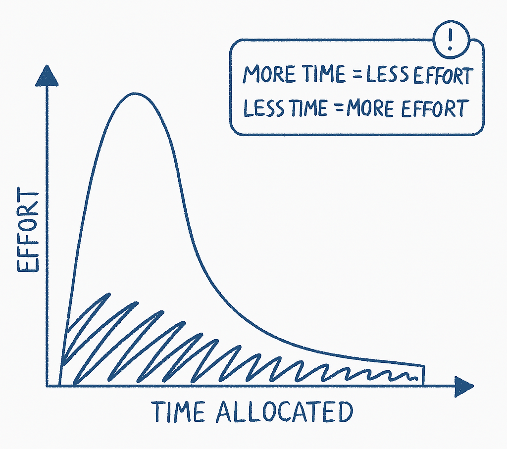

# Parkinson's Law

_Last updated: 2025-07-19_

Parkinson’s Law states: “Work expands to fill the time available for its completion.”

In product teams, this can lead to:
- Over-polishing
- Unnecessary meetings
- Delayed decisions or launches

🔗 [1955 Economist article](https://web.archive.org/web/20180705215319/https://www.economist.com/news/1955/11/19/parkinsons-law)

