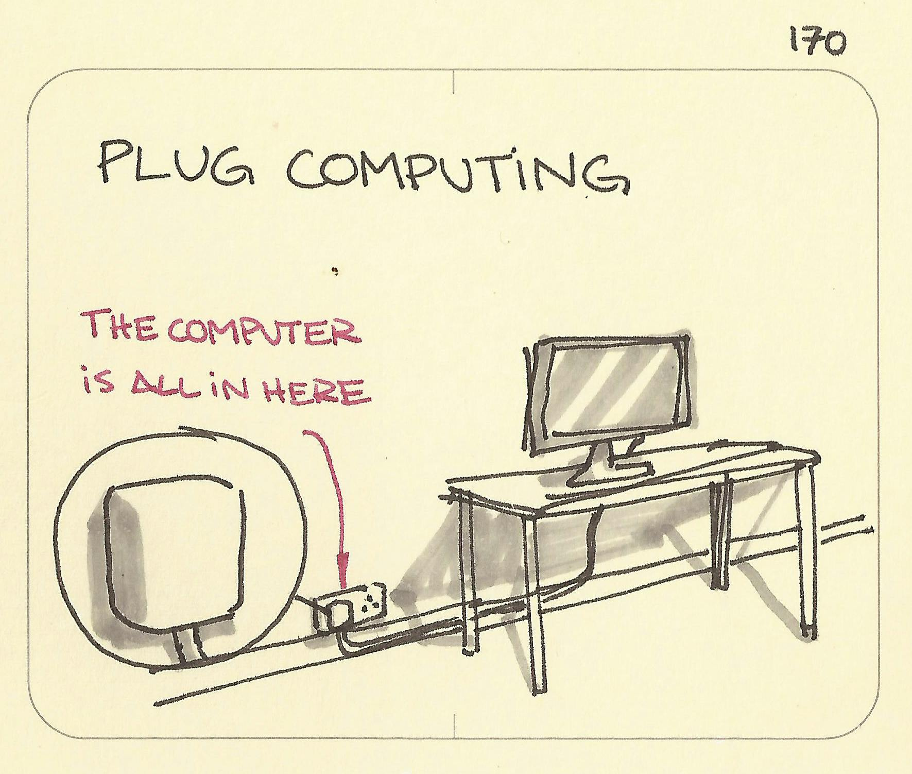

# Plug Computing

_Last updated: 2025-12-15_

**Plug Computing** refers to tiny, low-power computers that plug directly into a wall socket, essentially becoming a "computer in a plug" to provide always-on servicesis. In the Theory of Inventive Problem Solving there’s an idea that all functions will eventually be subsumed by the system above it. Assuming that we will always need some sort of power it makes sense that the computer will disappear into there at some point. The iMac was essentially a jump where the computer disappeared into the screen.

**Key insights for product managers**:
- Functions migrate toward infrastructure over time (ambient computing, IoT)
- Design attention should match longevity—invest in persistent elements
- Look for opportunities to integrate into existing systems users already have
- Challenge assumptions about where functionality should live

📘 [40 Principles: TRIZ Keys to Innovation](https://www.amazon.sg/40-Principles-Triz-Technical-Innovation/dp/0964074036)  
🔗 [Sketchplanations - Plug Computing](https://sketchplanations.com/plug-computing)

