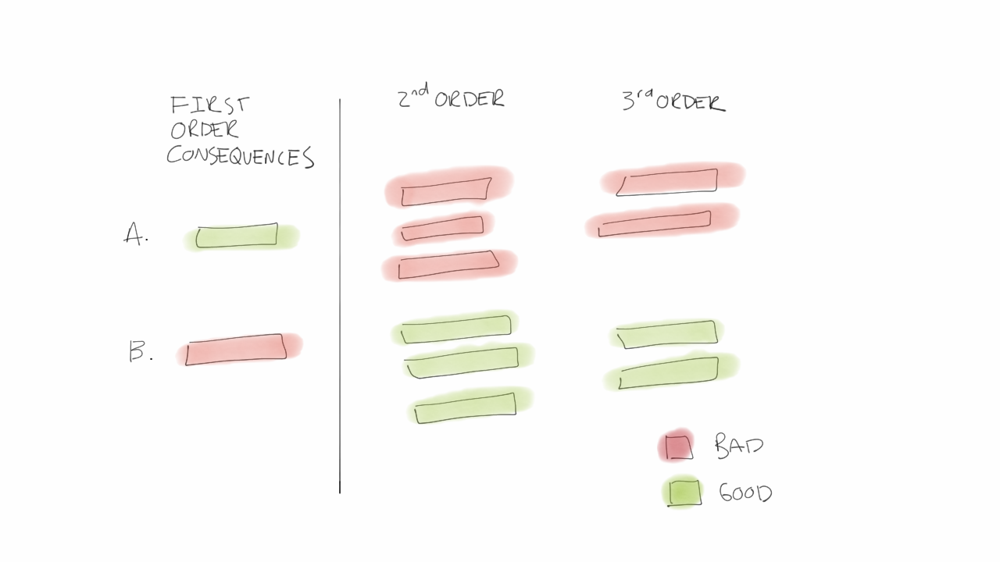

# Second-Order Thinking

_Last updated: 2025-07-19_

Second-Order Thinking is the ability to think beyond the immediate consequences of decisions and anticipate downstream effects. While first-order thinking asks, “What happens next?”, second-order thinking asks, “And then what?”

In product management, this is crucial when making roadmap decisions, implementing experiments, or launching features that could unintentionally change user behavior, increase support load, or create long-term debt.

Example: Introducing a new pricing tier might increase short-term revenue (1st order) but alienate power users or increase churn (2nd order).

Before acting, try ask:  
- "And then what?"
- What are the ripple effects of this decision?  
- Could this create unintended consequences over time?

🔗 [Second-Order Thinking: What Smart People Use to Outperform](https://fs.blog/second-order-thinking/)

