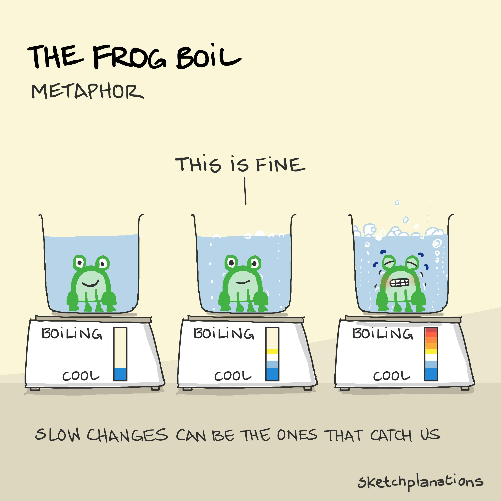

# Boiling Frog

_Last updated: 2025-12-15_

**Boiling Frog** is a metaphor describing how gradual changes go unnoticed until it's too late to react. Like a frog in slowly heating water, we fail to perceive incremental degradation or improvement.

The metaphor warns against complacency with slow-moving changes that accumulate into critical problems.

**Product management examples**:
- **Technical debt** - Small shortcuts compound into unmaintainable codebases
- **Performance degradation** - Page load times creep from 2s to 5s over months
- **User experience erosion** - Feature bloat gradually makes the product confusing
- **Market position** - Competitors slowly chip away at your differentiation
- **Team culture** - Meeting overhead and process creep reduce velocity

**How to avoid it**:
- Establish baseline metrics and monitor trends over time
- Set threshold alerts before problems become critical
- Regular retrospectives to surface incremental drift
- Compare current state to 6-12 months ago, not just last week

**Positive application**: Small improvements also compound unnoticed - incremental UX enhancements, code quality improvements, or process optimizations accumulate into significant competitive advantages.

🔗 [Sketchplanations - The Frog Boil Metaphor](https://sketchplanations.com/frog-boil)

