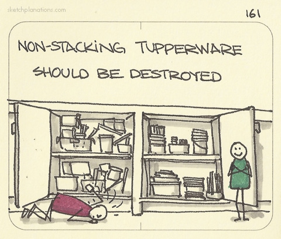

# Non-stacking Tupperware Should Be Destroyed

_Last updated: 2025-12-15_

A practical principle about eliminating unnecessary friction: "Do not hesitate to ditch that which doesn't stack and replace with ones that do. Life is too short." This seemingly trivial domestic advice reveals a powerful product insight.

Small, recurring frictions compound into significant pain points. Non-stacking containers waste cabinet space and create daily frustration searching for lids and managing chaos. The solution isn't to organize better—it's to standardize and eliminate the root cause.

For product managers, this principle applies everywhere. Systems work better when components are designed to integrate. Interoperability and modularity matter more than isolated feature excellence. Sometimes standardization delivers more value than flexibility.

**Key applications**:
- Identify and eliminate small recurring frictions in your product
- Design for the full lifecycle, including "inactive" or "storage" states
- Standardize core components to reduce cognitive load
- Consider how features integrate, not just how they function independently
- Small quality-of-life improvements deserve deliberate attention

🔗 [Sketchplanations - Non-stacking Tupperware](https://sketchplanations.com/non-stacking-tupperware-should-be-destroyed)

