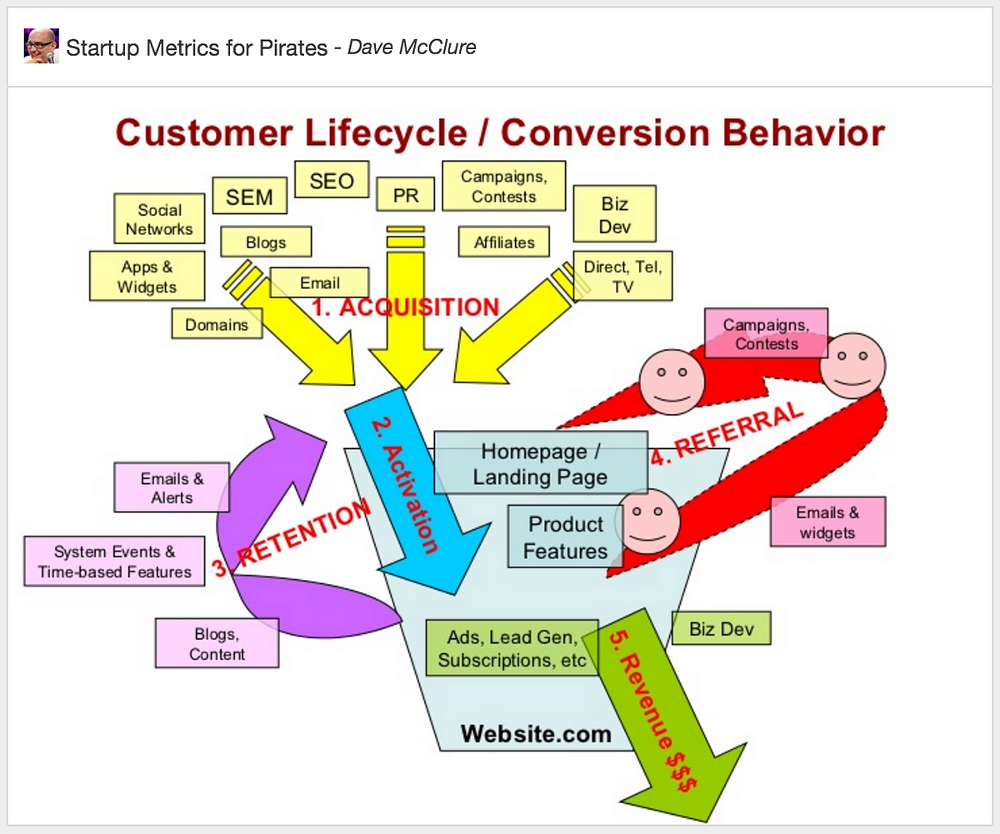

# AARRR Pirate Metrics Framework

_Last updated: 2025-04-13_

Developed by Dave McClure in 2007, AARRR helps startups measure key stages of the customer lifecycle:

- Acquisition – How users find you
- Activation – First happy experience
- Retention – Users keep coming back
- Referral – Users bring others
- Revenue – Users generate income

It’s great for startups, growth hacking, and funnel analysis.

📄 [Startup Metrics for Pirates](https://www.slideshare.net/dmc500hats/startup-metrics-for-pirates-long-version)

