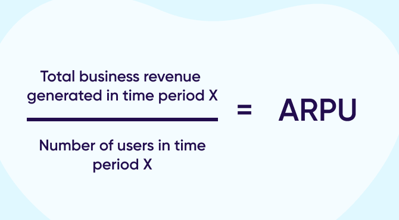

# Average Revenue Per User (ARPU)

_Last updated: 2025-04-13_

Average revenue per user (ARPU) is a financial metric that gauges the average income generated from each user or customer over a specific period. Businesses in sectors such as telecommunications, media, and technology use this metric to track trends in revenue generation and make strategic decisions about marketing, pricing, and product development.

ARPU measures the average monthly (or quarter, annual) revenue generated per user or unit.

ARPU = Total Revenue / Number of Active Users

Why it matters:
- Indicates monetisation efficiency
- Useful for benchmarking across segments
- Helps align product tiers with revenue goals

📄 [Average Revenue Per Unit (ARPU): Definition and How To Calculate](https://www.investopedia.com/terms/a/arpu.asp)

