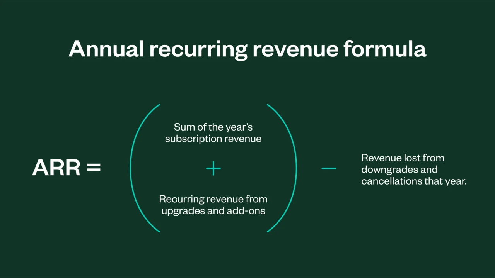

# Annual Recurring Revenue (ARR)

_Last updated: 2025-04-13_

Annual recurring revenue (ARR) is revenue derived from subscription agreements or other contractual payment agreements of one year or more. It is a key performance metric for Software-as-a-Service (SaaS) companies and subscription-based models as it directly measures the growth of their core business.

📄 [Annual Recurring Revenue: What is ARR & How to Calculate It](https://www.zuora.com/glossary/annual-recurring-revenue/)  
📄 [What Is ARR? How To Measure Annual Recurring Revenue (2025)](https://www.shopify.com/sg/blog/what-is-arr)  
📄 [Annual Recurring Revenue (ARR): Definition, Calculations, and Real-Life Usage](https://breakingintowallstreet.com/kb/venture-capital/annual-recurring-revenue-arr/)  

