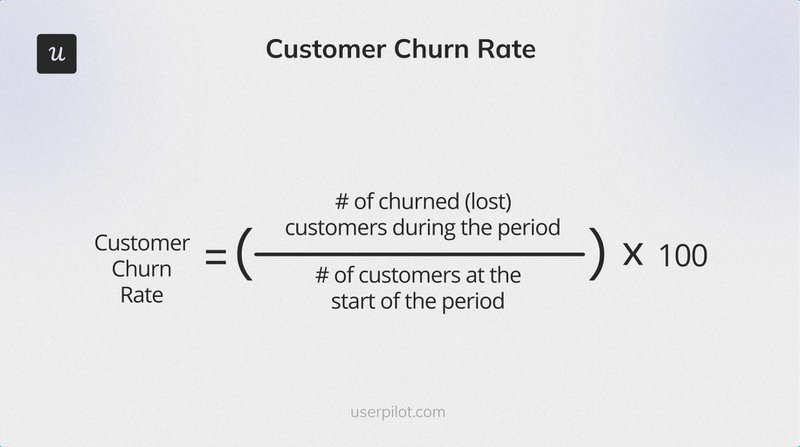

# Churn

_Last updated: 2025-12-14_

**Churn** is the rate at which customers or revenue is lost—a critical health indicator for subscription businesses. High churn limits growth by creating a "leaky bucket" that undermines acquisition efforts.

**Types of churn**:
- **Customer churn**: % of customers who cancel
- **Revenue churn**: % of MRR/ARR lost (accounts for contract size)
- **Net churn**: Gross churn minus expansion revenue (negative net churn = expansion exceeds losses)

**Why it matters**: Impacts growth ceiling, LTV:CAC ratio, and long-term sustainability. Small churn reductions have exponential effects.

**Common drivers**: Poor onboarding, bugs, lack of adoption, price misalignment, competition, budget cuts.

**Reducing churn**:
- Proactive intervention for at-risk customers
- Faster time-to-value onboarding
- Drive core feature adoption
- Customer success programs
- Address pain points from churn interviews

**Benchmarks**: SaaS targets <5% monthly (consumer), <2% (enterprise B2B).

🔗 [Customer Churn Analytics: A Product Manager’s Guide](https://userpilot.com/blog/customer-churn-analytics/)  
🔗 [Why investors don’t fund dating](https://andrewchen.com/why-investors-dont-fund-dating/#:~:text=break%20it%20down.-,Built-in%20churn,annual%20churn%20through%20the%20following:)

