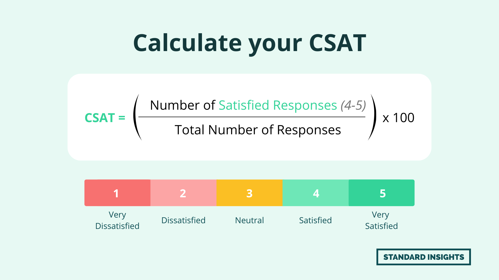

# Customer Satisfaction Score (CSAT)

_Last updated: 2025-12-14_

**CSAT** measures how satisfied customers are with a specific product, service, or interaction—focusing on immediate satisfaction rather than long-term loyalty (NPS). CSAT identifies friction points in the customer journey when measured consistently.

**How it works**: Customers answer "How satisfied were you with [experience]?" on a scale (1-5, 1-10, or binary).

**Formula**: (Satisfied Customers ÷ Total Responses) × 100
- "Satisfied" typically = 4-5 on 5-point scale or 8-10 on 10-point scale

**Common use cases**:
- Post-support surveys
- Feature feedback
- Onboarding assessment
- Transaction satisfaction
- Periodic product check-ins

**CSAT vs. other metrics**:
- **CSAT**: Specific interaction (short-term, tactical)
- **NPS**: Loyalty/recommend (long-term, strategic)
- **CES**: Effort to complete task (operational)

**Best practices**: Keep surveys short, ask immediately after interaction, follow up with open-ended questions, track trends over time, segment by customer type or touchpoint.

🔗 [HubSpot - How to Calculate and Improve CSAT](https://blog.hubspot.com/service/customer-satisfaction-score)

