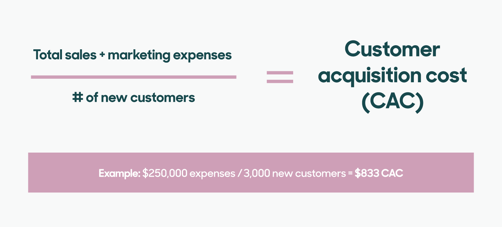

# Customer Acquisition Cost (CAC)

_Last updated: 2025-12-14_

**CAC** is the total cost to acquire a new customer. When analyzed with Customer Lifetime Value (LTV), it determines business sustainability and scalability. It indicates unit economics health, scalability, channel efficiency, and investor viability. CAC influences pricing, self-serve features, onboarding, and viral mechanisms. Products reducing CAC through self-service create competitive advantages.

**Formula**: Total Sales & Marketing Costs ÷ New Customers Acquired

**CAC by channel**:
- **Organic** (low CAC): SEO, word-of-mouth, viral loops, content, product-led growth
- **Paid** (higher CAC): Ads, outbound sales, events

**Key ratios**:
- **LTV:CAC**: Healthy = 3:1 or higher (below 1:1 = unsustainable)
- **Payback period**: <12 months ideal; 6-9 months best (time to recover CAC)

**Improving CAC**:
- Optimize conversion funnels
- Target high-value segments
- Increase organic channels
- Self-serve onboarding (product-led growth)
- Improve retention (extends LTV)

🔗 [Customer acquisition cost formula and tips to improve your CAC](https://www.zendesk.com/blog/customer-acquisition-cost/)

