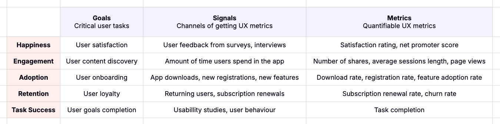

# HEART Framework

_Last updated: 2025-07-19_

Developed by Google’s UX team, the HEART Framework measures user experience across five key dimensions:
- Happiness – Satisfaction, loyalty (e.g., CSAT, NPS)
- Engagement – Depth and frequency of use
- Adoption – First-time use and new users
- Retention – Returning users over time
- Task Success – Efficiency and error rates

🔗 [HEART Framework](https://www.heartframework.com/)  
🔗 [Measuring the User Experience on a Large Scale: User-Centered Metrics for Web Applications](https://research.google/pubs/pub36299/)  

