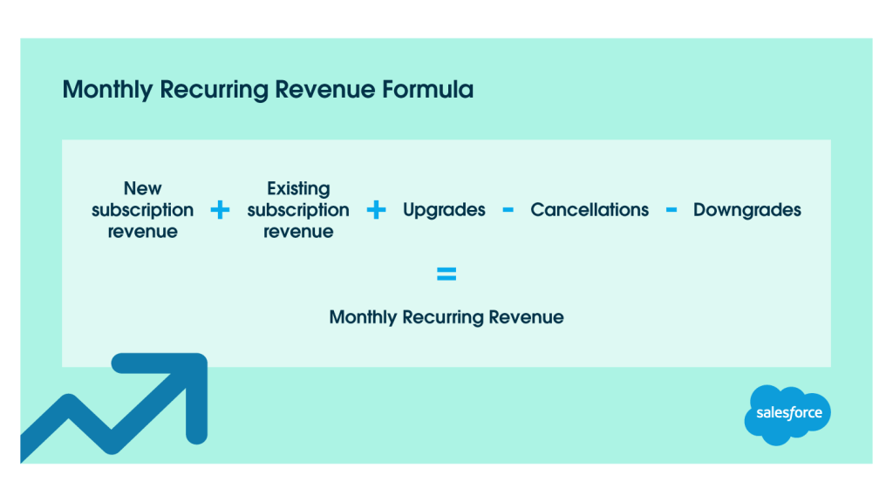

# Monthly Recurring Revenue (MRR)

_Last updated: 2025-12-14_

**MRR** is the predictable monthly revenue from active subscriptions—a critical metric for SaaS businesses. It excludes one-time fees, focusing on recurring revenue to assess business health and growth. MRR movements signal product-market fit, pricing effectiveness, and feature value. Expansion MRR indicates successful delivery; churned MRR highlights retention issues.

**Why it matters**: Enables forecasting, tracks growth momentum, informs investor discussions, and reveals churn patterns.

**MRR Components**:
- **New MRR**: Revenue from new customers
- **Expansion MRR**: Upgrades, add-ons, additional seats
- **Churned MRR**: Lost revenue from cancellations
- **Net New MRR**: New + Expansion - Churned

**Calculation**:
- Single customer: Monthly subscription price
- Annual contract: Annual value ÷ 12
- Total MRR: Sum of all normalized monthly subscriptions

🔗 [What is MRR, or monthly recurring revenue? How to calculate, increase and use MRR to guide growth](https://stripe.com/en-sg/resources/more/what-is-monthly-recurring-revenue)

