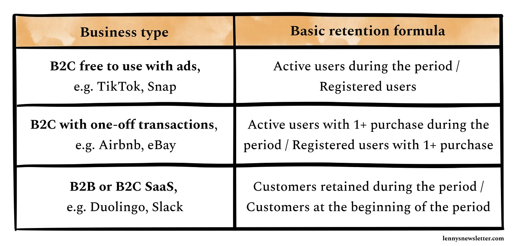

# Retention Rate

_Last updated: 2025-12-14_

**Retention Rate** measures the percentage of users who continue engaging with a product over time. It's a critical indicator of product-market fit, satisfaction, and long-term sustainability. Benchmarks can vary greatly. Retention matters more than acquisition because retained users generate compounding value through repeat usage, referrals, and expansion. Retaining customers costs 5-25x less than acquiring new ones.

Common approaches:
- **Cohort retention**: Track specific user groups over time
- **N-day retention**: Measure Day 1, Day 7, Day 30 returns
- **Rolling retention**: Users returning on or after specific days

🔗 [Why Retention Is The Silent Killer](https://www.reforge.com/blog/retention-engagement-growth-silent-killer)  
🔗 [How to measure cohort retention](https://www.lennysnewsletter.com/p/measuring-cohort-retention)  
🔗 [What is good retention?](https://www.lennysnewsletter.com/p/what-is-good-retention-issue-29)  

