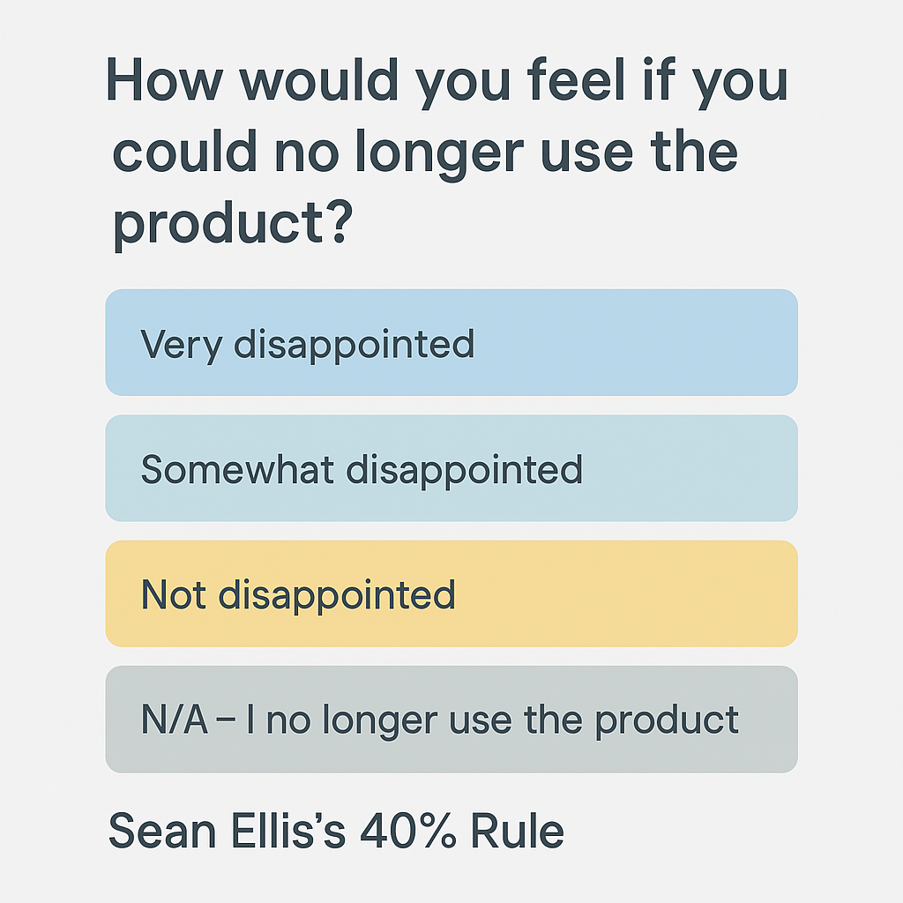

# The 40% Rule

_Last updated: 2025-04-13_

The 40% Rule (also known as the "Sean Ellis Test") is a simple but powerful litmus test for product/market fit. It helps determine if a product resonates strongly with its users — a key indicator before scaling.

How it works? Ask users. 
> “How would you feel if you could no longer use this product?”

If at least 40% respond “Very Disappointed”, you're likely close to product/market fit.

Why it matters:
- It’s quick, low-cost, and quantifiable
- Focuses on emotional user attachment, not vanity metrics
- Correlates with long-term growth and retention

Sean Ellis developed this rule while growing Dropbox, Eventbrite, and other high-growth startups. It continues to be a go-to signal for PMs and founders assessing early traction.

📄 [Measure and improve product/market fit with the 40% test](https://www.reforge.com/guides/measure-and-improve-product-market-fit)  
🖥️ [The original growth hacker reveals his secrets | Sean Ellis (author of “Hacking Growth”)](https://www.youtube.com/watch?v=VjJ6xcv7e8s)  
📘 [Hacking Growth](https://amzn.asia/d/8zEFEKX)

