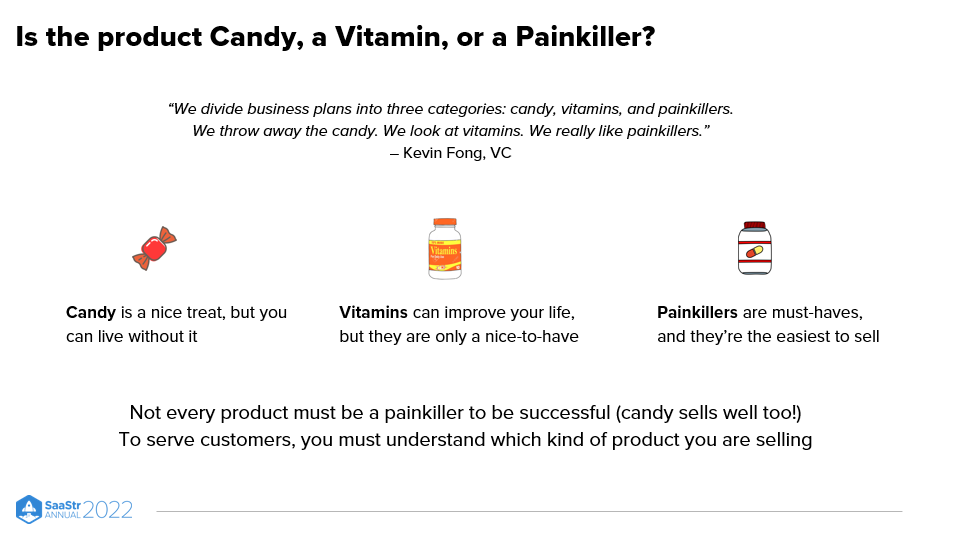

# Candy vs Vitamins vs Painkillers

_Last updated: 2025-04-13_

In product development, painkillers solve an urgent, painful problem, while vitamins are nice-to-haves that improve quality of life but aren't critical.

Why it matters:
- Painkillers are easier to monetize and market (people pay to remove pain).
- Vitamins often require stronger branding or emotional appeal to gain adoption.

The ideal product starts as a painkiller — solving a real, high-frequency problem — and evolves into a vitamin, expanding its value and engagement.

📄 [Why You Want To Develop Product Painkillers, Not Vitamins with DigitalOcean CPO Gabe Monroy](https://www.saastr.com/why-you-want-to-develop-product-painkillers-not-vitamins-with-digitalocean-cpo-gabe-monroy-pod-633-video/#:~:text=buy%20it.%20Why%3F-,Candy%2C%20Vitamins%2C%20and%20Painkillers,-Kevin%20Fong%2C%20a)  

