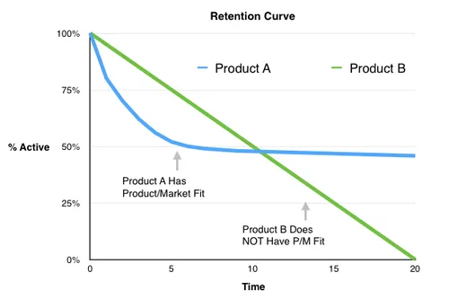

# Product Market Fit

_Last updated: 2025-12-15_

**Product Market Fit (PMF)** is the degree to which a product satisfies strong market demand. It's the sweet spot where what you've built resonates deeply with your target customers, creating sustainable growth and retention. Marc Andreessen defined it as "being in a good market with a product that can satisfy that market." When you have PMF, customers actively seek your product, usage grows organically, and churn decreases significantly. Tip: Before scaling marketing or sales, validate PMF through user surveys, retention cohorts, and growth metrics. Without PMF, optimization efforts yield diminishing returns.

**Key indicators of PMF**:
- Users would be "very disappointed" if they could no longer use your product (40% rule)
- Strong organic growth through word-of-mouth
- High retention rates and low churn
- Customers pull the product from you rather than you pushing it to them
- Clear market signal: people are willing to pay and recommend

🔗 [How to Know If You've Got Product-Market Fit](https://www.lennysnewsletter.com/p/how-to-know-if-youve-got-productmarket)  
🔗 [Marc Andreessen: The Only Thing That Matters](https://pmarchive.com/guide_to_startups_part4.html)

