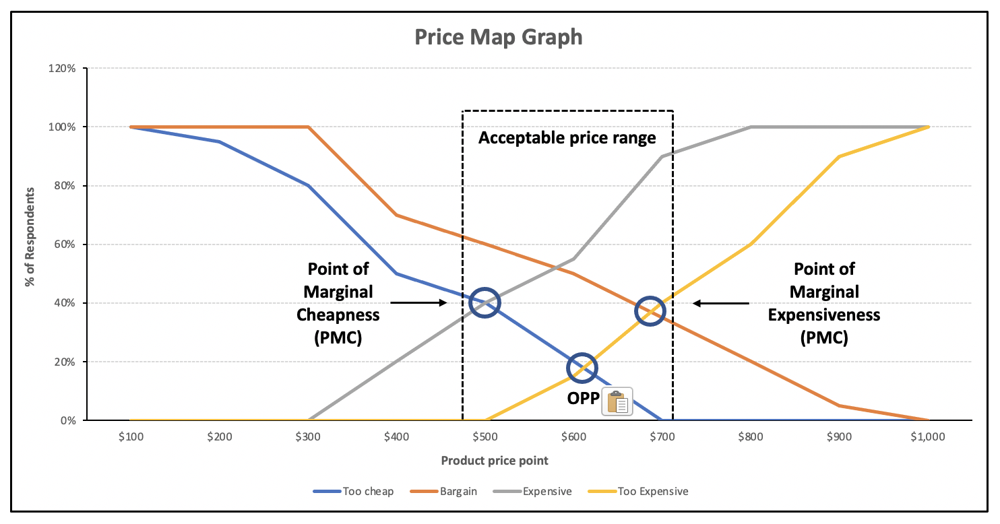

# Van Westendorp Price Sensitivity Meter (PSM)

_Last updated: 2025-04-13_

The Van Westendorp Price Sensitivity Meter (PSM) was introduced in 1976 by Dutch economist Peter van Westendorp. This market technique is used to find the optimal price range for a product based on customer perception of value. Useful for SaaS, Direct-to-Consumer (DTC) products, and early-stage pricing strategy.

It asks 4 key questions:
1. At what price would you consider the product too expensive?
2. At what price would you consider the product too cheap (low quality)?
3. At what price is it starting to seem expensive, but still acceptable?
4. At what price is it a bargain (good value for money)?

These responses generate a price sensitivity graph that identifies:
- Indifference price point
- Optimal price point (OPP)
- Price thresholds

🔗 [Pricing Products the Silicon Valley Way - Van Westendorp Model](https://www.firstprinciples.ventures/insights/pricing-products-the-silicon-valley-way-van-westendorp-model)  
🔗 [Van Westendorp Pricing Model: Definition, How It Works, Examples, and More](https://sawtoothsoftware.com/resources/blog/posts/van-westendorp-pricing-sensitivity-meter)

