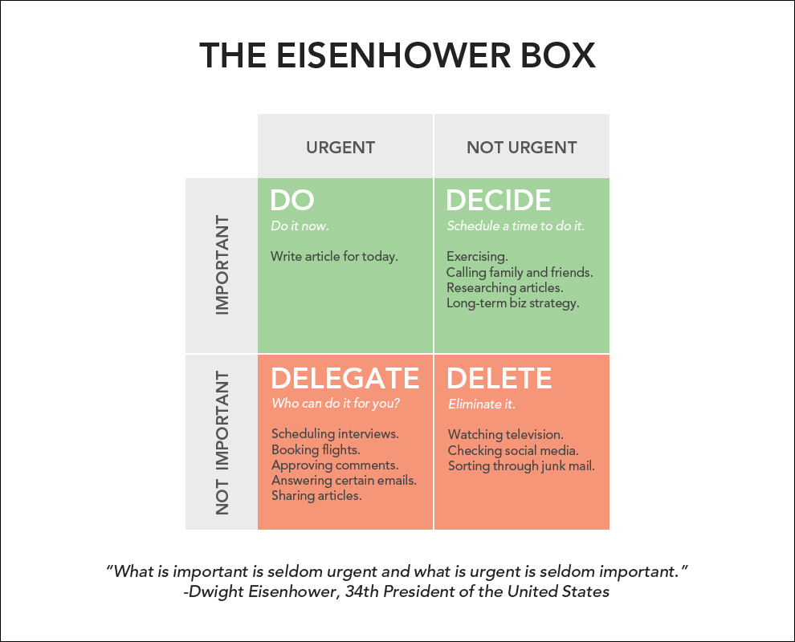

# Eisenhower Matrix

_Last updated: 2025-12-14_

The **Eisenhower Matrix** (Urgent-Important Matrix) categorizes tasks based on urgency and importance. Eisenhower said: "What is important is seldom urgent, and what is urgent is seldom important."

**The Four Quadrants**:
- Q1: Urgent & Important (Do First / Crisis)
- Q2: Not Urgent but Important (Schedule / Strategic)
- Q3: Urgent but Not Important (Delegate / Distraction)
- Q4: Not Urgent & Not Important (Eliminate / Waste)

Spending time in Q2 (strategic work) prevents Q1 fires. Avoid urgency bias—loud requests aren't always important. Balance short and long-term by protecting Q2 time. Tips: Review calendar weekly, block Q2 time first, ask "What if I didn't do this?", collaborate on importance criteria, revisit as goals shift.

🔗 [The Eisenhower Matrix](https://www.eisenhower.me/eisenhower-matrix/)  
🔗 [How to be More Productive](https://jamesclear.com/eisenhower-box)

